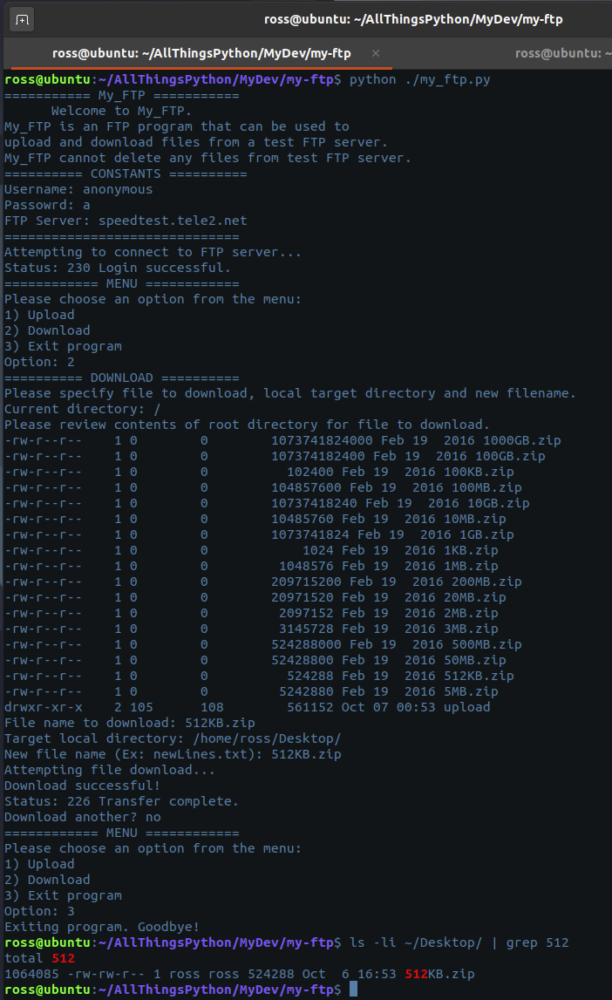

# my-ftp
> small ftp program that uploads and downloads files via FTP interaction with speedtest.tele2.net

A simple program designed to work with speedtest.tele2.net specifically with use of the built-in ftplib library. my_ftp can upload files to the ftp, or download files from the ftp, which does come with several files of various sizes for testing purposes.



### Script workflow
- prompt user whether they would like to download or upload
- Go through process of selecting file to upload or download
- Action will be performed and user will be prompted to perform another action or exit application

## Environment Setup

1. Install Python (Linux-oriented)
```$ sudo apt-get update```  
```$ sudo apt-get install python3.8```  

2. Set up virtual environment (recommended, not required)
*Version/path dependent on your Python installation*
```sudo apt-get install python3-pip```
```pip install virtualenv```
```python3 -m venv env```

3. Activate virtual environment from working directory in repository
```source env/bin/activate```

4. Download requirements.txt file to your working repository, then install required packages via pip
```pip install -r requirements.txt```


## Running the application
```python my_ftp.py```


<!-- Markdown link & img dfn's -->
